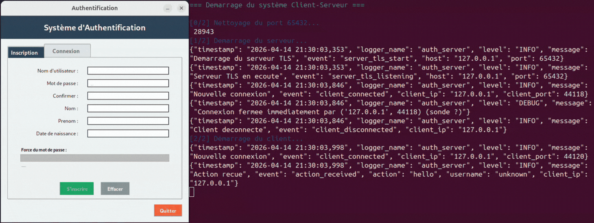
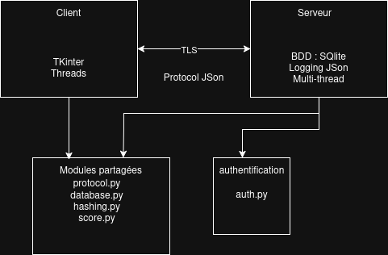
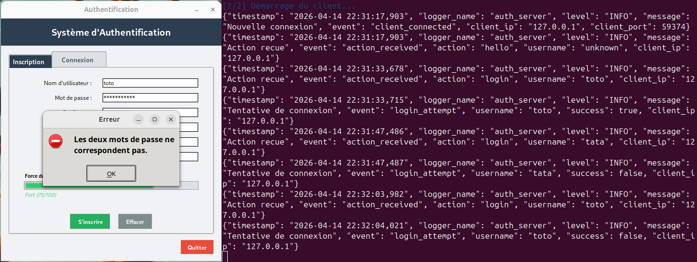
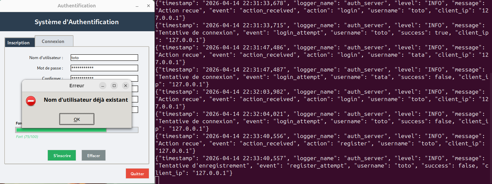
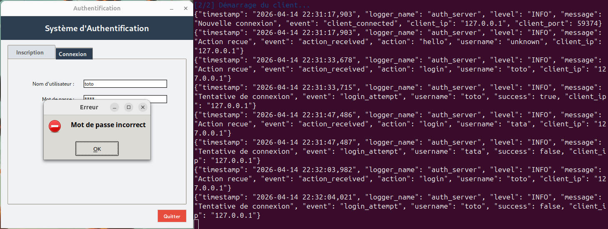
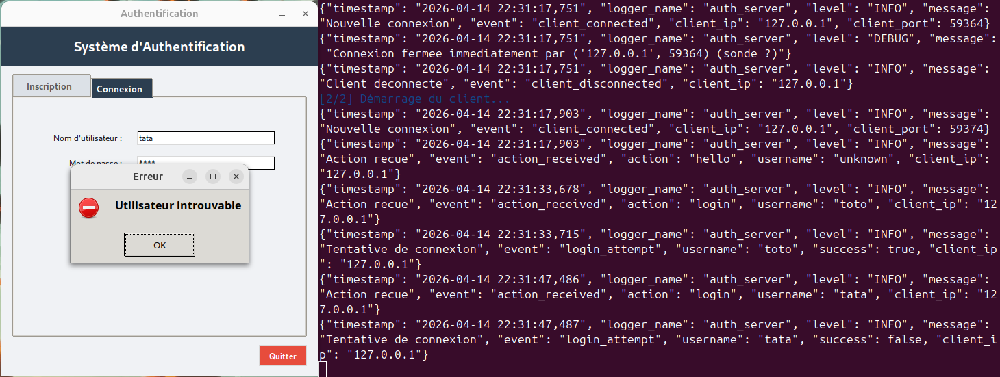
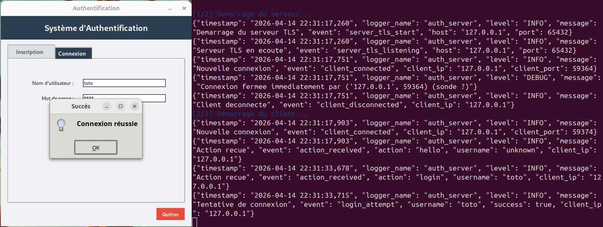
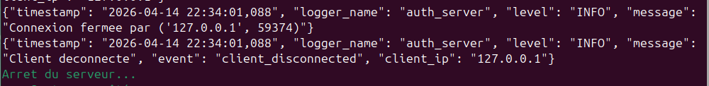

# Verificateur de mot de passe Client-Serveur

Projet personnel de cybersécurité et réseaux : implémentation d'un système d'authentification sécurisé avec vérification de mot de passe, communication chiffrée SSL/TLS, architecture client-serveur multi-thread, et le logging côté serveur.



---

## Table des Matières

- [À Propos du Projet](#-à-propos-du-projet)
- [Fonctionnalités Clés](#-fonctionnalités-clés)
- [Architecture Technique](#️-architecture-technique)
- [Technologies Utilisées](#️-technologies-utilisées)
- [Phase 1 : Vérificateur de Mots de Passe](#-phase-1--vérificateur-de-mots-de-passe)
- [Phase 2 : Client-Serveur](#-phase-2--client-serveur)
- [Sécurité](#-sécurité)
- [Logging Structuré](#-logging-structuré)
- [Multi-Threading](#-multi-threading)
- [Installation](#-installation)
- [Utilisation](#-utilisation)
- [Structure du Projet](#-structure-du-projet)
- [Défis Rencontrés](#-défis-rencontrés)

---

## À Propos du Projet

Ce projet est le fruit d'un travail personnel en lien avec mes études. Il s'articule autour de deux phases complémentaires :

**Phase 1** : Développement d'un vérificateur de mots de passe en local avec analyse de la force, hashage sécurisé (Argon2) et stockage en base de données SQLite.

**Phase 2** : Transformation en système client-serveur avec interface graphique Tkinter, communication chiffrée SSL/TLS, logging JSON structuré et gestion multi-clients.

### Contexte Pédagogique

- **Objectif** : Comprendre les principes de sécurité applicative et de communication réseau
- **Compétences développées** : 
  - Cryptographie (hashing, SSL/TLS)
  - Programmation réseau (sockets, protocoles)
  - Architecture logicielle (client-serveur, multi-threading)
  - Sécurité applicative (validation, authentification)

---

## Fonctionnalités Clés

### Vérification de Mot de Passe
- Analyse de la complexité (longueur, types de caractères)
- Calcul du score
- Vérification avec des dictionnaire de mots de passe communs (zxcvbn)
- Feedback

### Sécurité Avancée
- Hashage Argon2
- Chiffrement SSL/TLS 1.2+ pour les communications
- Validation côté serveur
- Génération automatique de salt unique

### Architecture Réseau
- Communication par sockets TCP
- Protocole JSON personnalisé
- Support multi-clients simultanés
- Gestion des déconnexions

### Observabilité
- Logging structuré en JSON
- Traçabilité (connexions, authentifications, erreurs)
- Horaires de chaque évènement

### Interface Utilisateur
- GUI Tkinter
- Threading pour éviter le blocage de l'interface
- Feedback visuel

---


## Architecture Technique

### Diagramme d'Architecture



---

### Flux de Communication

1. **Connexion** : Le client initie une connexion SSL/TLS
2. **Handshake** : Établissement du canal sécurisé
3. **Authentification** : Envoi des credentials en JSON
4. **Validation** : Le serveur vérifie et hashe le mot de passe
5. **Réponse** : Retour du statut (succès/échec + détails)
6. **Logging** : Chaque action est loggée en JSON

---

## Technologies

### Langage & Frameworks
- **Python 3.8+** - Langage principal
- **Tkinter** - Interface graphique
- **SQLite3** - Base de données locale

### Sécurité
- **Argon2** (`argon2-cffi`) - Hashing de mots de passe
- **SSL/TLS** (`ssl`) - Chiffrement des communications
- **zxcvbn** - Évaluation de la force des mots de passe

### Réseau & Communication
- **socket** - Programmation réseau TCP
- **threading** - Gestion multi-clients
- **json** - Protocole de communication

### Logging & Observabilité
- **python-json-logger** - Logging structuré
- **logging** - Module standard Python

### Outils de Développement
- **OpenSSL** - Génération de certificats
- **DB Browser for SQLite** - Gestion de la base

---

## Phase 1 : Vérificateur de Mot de Passe local

Créer un vérificateur local de mots de passe avec stockage sécurisé.
1. Analyse de Complexité
2. Calcul de Score
3. Hashage Sécurisé

Reprise du travail réalisé :

https://github.com/Garagorn/Validateur-MDP 

---

## Phase 2 : Client-Serveur

### Objectifs
Transformer le vérificateur en système d'authentification réseau sécurisé.

### Protocole de Communication

#### Format des Messages (JSON)

**Requête Client -> Serveur**
```json
{
  "action": "register",  // ou "login"
  "username": "alice",
  "password": "MonMotDePasse123!"
}
```

**Réponse Serveur -> Client**
```json
{
  "status": "success",  // ou "error"
  "message": "Compte créé avec succès",
}
```

### Implémentation Socket

#### Serveur
```python
# Écoute sur port 65432
# Accepte connexions entrantes
# Thread par client
# Wrap SSL/TLS
# Traitement requêtes
# Logging JSON
```

#### Client
```python
# Interface Tkinter
# Thread séparé pour socket
# Queues pour communication thread-safe
# Wrap SSL/TLS
# Gestion erreurs réseau
```

---

## Sécurité

1. Hashing de Mots de Passe


### 2. SSL/TLS

**Configuration Serveur**
```python
context = ssl.SSLContext(ssl.PROTOCOL_TLS_SERVER)
context.load_cert_chain(
    certfile='certs/server.crt',
    keyfile='certs/server.key'
)
```

**Génération Certificat**
```bash
# Clé privée
openssl genrsa -out server.key 2048

# Certificat auto-signé (365 jours)
openssl req -new -x509 \
  -key server.key \
  -out server.crt \
  -days 365
```

### 3. Validation des Entrées

```python
# Côté serveur uniquement
- Vérification longueur max
- Requêtes préparées
- Validation format JSON
```

---

## Logging Structuré

### Format JSON

- Pour la facilité possible du parsing
- Pour une structure simple
- Pour être plus simple à analyser

**Exemple de Log**
```json
{
  "timestamp": "2026-04-14T15:30:45.123Z",
  "logger_name": "auth_server",
  "level": "INFO",
  "message": "Tentative de connexion",
  "event": "login_attempt",
  "username": "alice",
  "success": true,
  "client_ip": "127.0.0.1",
  "tls_version": "TLSv1.2",
  "thread_name": "Client-3"
}
```

### Événements Loggés

Événement : Level : Description

- `server_start` : INFO : Démarrage serveur
- `client_connected` : INFO : Nouvelle connexion
- `ssl_handshake` : INFO : SSL/TLS établi
- `register_attempt` : INFO : Tentative inscription
- `login_attempt` : INFO : Tentative connexion
- `unknown_action` : WARNING : Action non reconnue
- `ssl_error` : ERROR : Erreur SSL/TLS
- `connection_error` : ERROR : Erreur réseau
- `server_shutdown` : INFO : Arrêt serveur

### Exemples

#### Enregistrement





#### Connexion










---

## Multi-Threading

### Architecture Threading

Le serveur (thread principal) créer des threads pour chaques clients

- Thread Client 1 -> handle_client()
- Thread Client 2 -> handle_client()
- Thread Client 3 -> handle_client()
- ...

**Avantages**
- Plusieurs clients simultanés
- Pas de blocage serveur
- Isolation des erreurs par thread

---

## Installation

### Prérequis
- Python 3.8+
- OpenSSL (pour certificats)
- SQLite3

### Étapes

1. **Cloner le repository**
```bash
git clone https://github.com/Garagorn/VerificateurMotDePasse_Client_Serveur.git
cd VerificateurMotDePasse_Client_Serveur
```

2. **Créer environnement virtuel**
```bash
python -m venv venv
source venv/bin/activate  # Linux/Mac
# ou
venv\Scripts\activate  # Windows
```

4. **Générer certificats SSL**
```bash
mkdir certs
cd certs
openssl genrsa -out server.key 2048
openssl req -new -x509 -key server.key -out server.crt -days 365
cd ..
```

5. **Créer dossiers nécessaires**
```bash
mkdir logs
```

---

## Utilisation

### Démarrer le Serveur

```bash
python Client_Serveur/Serveur/server.py
```

**Sortie attendue :**
{"timestamp": "2026-04-14T15:30:00.000Z", "level": "INFO", "message": "Démarrage serveur", ...}
{"timestamp": "2026-04-14T15:30:00.100Z", "level": "INFO", "message": "Serveur en écoute", ...}

### Lancer le Client

```bash
python Client_Serveur/Client/client_gui.py
```

### Tester en Local

1. Démarrer le serveur
2. Lancer 2-3 clients
3. Créer des comptes
4. Se connecter
5. Vérifier les logs dans `logs/server.log`

---

## Structure du Projet

```
VerificateurMotDePasse_Client_Serveur/
│
├── README.md
│
├── Client_Serveur/
│   ├── Client/
│   │   ├── client_gui.py          # Interface Tkinter
│   │   └── client_socket.py       # Logique socket
│   │
│   ├── Serveur/
│   │   ├── server.py               # Serveur principal
│   │   ├── server_tls.py           # Serveur réutilisant server.py mais avec TLS  
│   │   ├── auth.py                 # Logique authentification
│   │   ├── logger_config.py        # Config logging
│   │   └── server_database.py      # Interface BDD
│   │   └── Verificateur/
│   │       ├── server_database.py   # Action sur la BDD
│   │       ├── server_hashing.py    # Action de hashage
│   │       ├── server_score.py      # Action de calcul de score
│   │       └── server_verif_dico.py # Action de vérfication avec dictionaire
│   │
│   │
│   └── Common/
│       └── protocol.py             # Protocole partagé
│
├── certs/
│   ├── server.crt                  # Certificat serveur
│   └── server.key                  # Clé privée
│
├── logs/
│   └── server.log                  # Logs JSON
│
└── docs/
├── demo.gif                    # Démo visuelle
├── diagramme.png            # Diagramme
└── screenshots/                # Captures d'écran
```

---

## Défis Rencontrés

### 1. Threading avec Tkinter

**Problème** : L'interface se bloquait pendant les opérations réseau.

**Solution** : Implémentation d'un thread séparé pour le socket avec communication via `Queue`.

### 2. Gestion des Déconnexions
**Problème** : Le serveur crashait si un client se déconnectait brutalement.

**Solution** : Gestion d'exceptions robuste et cleanup dans `finally`.

### 3. Certificats SSL Auto-signés
**Problème** : Le client refusait les certificats auto-signés.

**Solution** : Configuration appropriée du contexte SSL client.

```python
context.check_hostname = False
context.verify_mode = ssl.CERT_NONE
```

---

## Ressources & Références

### Documentation

[Utilisation des sockets en python](https://realpython.com/python-sockets/)

[Documentation socket](https://docs.python.org/3/library/socket.html)

[Documentation JSon](https://docs.python.org/3/library/json.html)
 
[Utilisation de thread avec Tkinter](https://www.pythontutorial.net/tkinter/tkinter-thread/)

[Documentation Queue](https://docs.python.org/3/library/queue.html)

[Utilisation des threads](https://realpython.com/intro-to-python-threading/)

[Documentation SSL TLS](https://docs.python.org/3/library/ssl.html)


### Tutoriels Suivis

[Utilisation de thread](https://medium.com/swlh/lets-write-a-chat-app-in-python-f6783a9ac170)

[Multi-threading](https://www.geeksforgeeks.org/socket-programming-multi-threading-python/)

[Thread avec TKinter](https://www.pythontutorial.net/tkinter/tkinter-thread/)

[Utilisation de JSon avec le logging](https://betterstack.com/community/guides/logging/json-logging/)

[Utilisation de TLS](https://www.electricmonk.nl/log/2018/06/02/ssl-tls-client-certificate-verification-with-python-v3-4-sslcontext/)

---

# Auteur
# Basile **Tellier**
